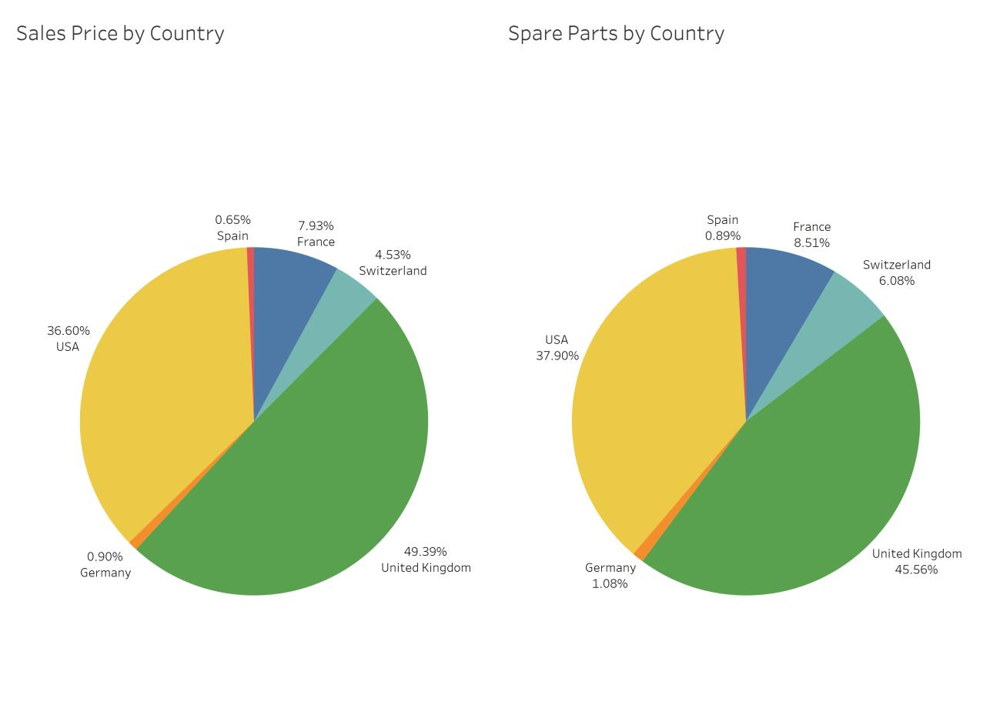

# Car Sales Exploratory Analysis

## Problem Statement
Build visualizations in Tableau on the car brand sales data and derive insights that can help businesses make data driven decisions.

## Analysis
### Ask-1

**Difference between countries in terms of average sales price and average cost price:** 
Profit is the difference between sales price and cost price. The Y-axis show the average profit and the X-axis shows the make of the product and the country in which the product is being sold. From the plot, we can say the business has booked profit in all the countries. One key observation from the data is that UK, USA, and France show similar trends.

**Difference between makes in a country:** 
The big picture looks promising in terms of sales for almost all the makes in a country. As stated earlier, customers in UK, USA and France show similar tastes in terms of their preference of the vehicle make. Jaguar ranks at the lower end compared to all other brands in all the countries except one. This could be due to varying market strategies, lifestyle, availability etc. TVR made losses in all the five countries except for Spain. So, it is advisable to halt sales in France, Germany, Switzerland, UK, and USA.

### Justification-1

This is a multi-layered problem where the business owners are trying to find the difference between the countries on average sales price and average cost price. We also need to understand how the vehicle make trends in each country. The main attributes for this visualization are:
- Sales Price – Selling price of the vehicles
- Cost Price – Cost of raw materials and labor to manufacture the vehicle
- Make – The manufacturer of the vehicle
- Country – The country where the vehicle was sold

Any business decision hinges on profit or loss. In this case, since we are asked for the effect of average sales price and average cost price, the key metric we are looking for is profit. So, I calculated the profit as a dimension by subtracting cost price from sales price. I chose bar chart to convey the profit figures across all makes based on country. This leads to a two-layered bar chart which shows average profit as Y-axis and the make of the vehicle with country on X-axis.

 | 

I chose to show the average profit on the individual bars as well, so I did some format adjustments so that it will be easy for the viewer to make sense of the data more easily.

### Ask-2

**Average spare parts sales by make and country:** 
Spare parts management is very challenging and very cost intensive. So, outsourcing seems like a viable option to cut costs wherever possible. The Y-axis shows the average spare parts sales, and the X-axis shows the vehicle make and country in which the vehicles were sold. We can clearly see Jaguar hovering below threshold in Germany and Spain.
MGB is below threshold in UK and USA whereas Triumph and TVR are not doing so good in countries like France, Germany, Spain, UK, USA etc. Apart from these, all other models justify the spare parts inventorying costs which is above the threshold of $500.

### Justification-2

This is again a multi-layered problem where the business owners are trying to figure out the best way to outsource spare part sales. The main attributes for this visualization are:
- Spare parts – Sales figures of all the spare parts
- Make – The manufacturer of the vehicle
- Country – The country where the vehicle was sold
The threshold set by the business is $500 which gives me a reference so I can base my visualizations around this value. The bar chart again is the best visualization to show the spare part sales. One key aspect of having a threshold set by the business owners tells me that they want to get a clear picture of spare part sales so that they can take a quick decision to outsource the spare parts. This leads to a two-layered bar chart which shows average spare part sales on Y-axis and the make of the vehicle and country on the X-axis.

 | 

initially created a sheet with calculated field (Shown above) to get the reference line dictate the color of the bar chart. This means if we adjust the threshold from $500 to say $1000, the reference line changes and the colors on bar chart shifts. But I decided to go with individual color coding on the bars under the threshold which seemed to be easy to understand and clearer.

### Ask-3

**Proportion of sales and spare parts generated in each country:** 
The first pie chart shows the sales generated by each country. Most of the sales are from USA and UK amounting to over 86% of the sales combined. This is followed closely by France and Switzerland amounting to over 12% of the total sales. Spain and Germany have sales which account to less than 1% each so it is a good move to exit these markets.
The second pie chart shows the spare parts sales by each country. Most of the spare part sales are dominated by USA and UK with over 82% of the combined spare sales. This is followed by France and Switzerland with over 14% of the spare sales. Again, Spain and Germany are at the bottom at around 1% each and it would be best to exit these markets.

### Justification-3

In this case the business owners want to decide on the vehicle sales and the spare part sales. The main attributes for this visualization are:
- Spare parts – Sales figures of all the spare parts
- Sales Price – Selling price of the vehicles
- Country – The country where the vehicle was sold
Pie charts are the best way to represent this type of data. It shows the percent share (Pie) of the metric in a clear-cut way which is easily understood by anyone. Since we cannot have a multi-layered pie chart, I had to make two. The first one is for the sales price against each country and the second one is for the spare parts against each country. Some countries that had a minute proportion had to be included so I manually sorted the pie chart to chart all the countries. I chose the default colors and changed the title to convey the purpose of the chart clearly.
Initially, I was a bit confused seeing a very tiny pie chart and tried to zoom-in with the re-size option on the “Marks” panel to the left. But the chart was not centered so I had to look around and found that there is an invisible boundary around the pie chart. I tried to drag and adjust it to the page width, so I have a centered pie chart.

## Conclusion

With this project I got a chance to brush up my tableau skills and get to build some insightful visualizations. In this project I have used simple plots to tell data driven story with very nice looking visualizations to convey the information and insights in the most consice way possible.